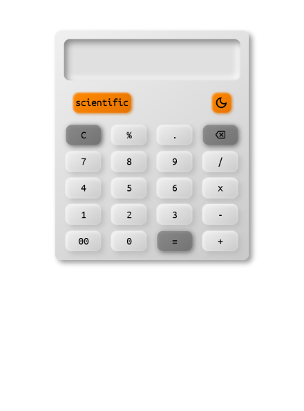
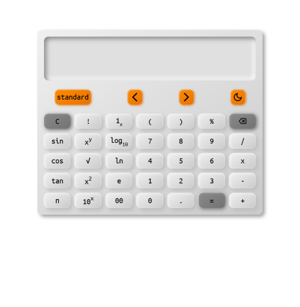
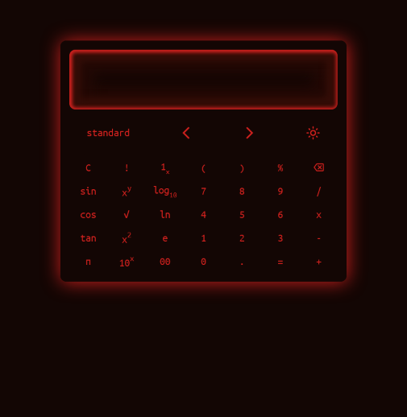
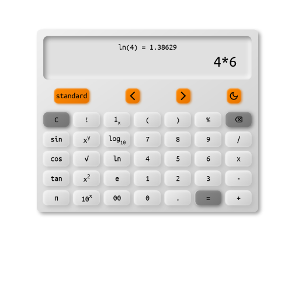

# Calculator

## Table of contents
- [Calculator](#calculator)
  - [Table of contents](#table-of-contents)
  - [Overview](#overview)
    - [Screenshots](#screenshots)
    - [Links](#links)
  - [My process](#my-process)
    - [Built with](#built-with)
    - [What i learned](#what-i-learned)
  - [Author](#author)

## Overview

An online calculator which contains:
  - standard mode
  - scientific mode
  - light mode 
  - dark mode
  - calculations history

In the standard mode the user can do simple calculations, whether at the scientific mode, more math functions are available. The calculator can store up to 10 calculations.

### Screenshots

### Links
- Solution URL: [Github](https://github.com/kostas23Github/whitecalculator)
- Live Site URL: [Github Pages]()
## My process

The structure of the project was done with HTML5, the styling with CSS3 and JavaScript. The logic with JavaScript. Every button has its own listener which invokes the appropriate handler. For the math calculations a variation of the eval() function is used, from now on called evaly(). Upon clicking a button a string with the value of it is displayed in the screen. When the user clicks the (=) button the evaly() calculates the result. For each math operation a separate function is used to calculate the specifi result and display it on the screen, then the evaly() will do the rest calculations. The user can also erase specific parts of his calculation or type wherever in the calculation display he wants. In case of an error, an Error string is displayed. On the scientific mode a record of prior calculations is displayed from which the user can see and toggle between the last 10 calculations in the form of x + y = z. The history record is stored in an array, which is updated with every result. 
### Built with

-HTML5
-CSS3
-CSS3 Grid 
-JavaScript
-DOM API
### What i learned

## Author
- Github - [kostas23Github](https://github.com/kostas23Github)